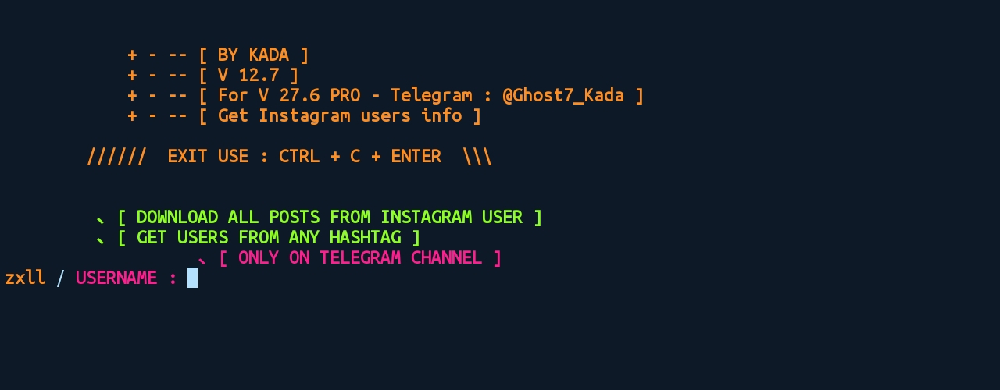

# ⚙ last update was 19 March 2021.

``old update was 9 March 2021.``

``old update was 9 January 2021.``

``old update was 4 January 2021.``

``old update was 2 April 2020.``

<p align="center">
   <a href="https://twitter.com/kada_soulayman">
      
   </a>
   <a href="https://github.com/zxllkada/Get-instagram-users-info---Any-instagram-account">
      
   </a>
   <a href="https://github.com/zxllkada">
      
   </a>
</p>

``Screenshot``

# About this tool

:warning: Note! : DO NOT USE THIS TOOL FOR CKRACKING

This tool works prefect on termux without any ERRORS
* If you found any ERRORS please contact me.
* Was developed using python3

```
   Telegram : @ZKada
   Facebook : Facebook.com/zxlll
```

This tool helping you to get Instagram users informations without login to your account.


# install ON TERMUX OR LINUX :
```
   pkg update && upgrade
   pkg install git python
   pip3 install -r requirements.txt
   git clone https://github.com/zxllkada/Get-instagram-users-info---Any-instagram-account
```

# RUNNING
```
   cd Get-instagram-users-info---Any-instagram-account
   cd zxllkada
   cd Dump_Instagram_Information_ANY_ACCOUNT
   python3 InstaInfo_zxll.py
```
* After that enter {username} and enjoy.


# DATA [ UPDATES SOON ]
```
[ SURE FACE DATA ] 
        、__ [~] Username
        、__ [~] Full Name
        、__ [~] Biography
        、__ [~] External Url
        、__ [~] External Url Linkshimmed
        、__ [~] Edge Followed By
        、__ [~] Edge Follow
        、__ [~] is Private
        、__ [~] is Verified
        、__ [~] Category Enum
        、__ [~] Profile Pic Url Hd
        、__ [~] Show Suggested Profiles
        、__ [~] Show Follow Dialog
        、__ [~] Show View Shop
        、__ [~] Highlight Reel Count
        、__ [~] Edge Felix Video Timeline
        、__ [~] Edge Owner To Timeline Media
        、__ [~] Has Clips
        、__ [~] Has Guides
        、__ [~] Has Ar Effects
        、__ [~] Has Channel
 [ DEEP DATA ]
        、__ [~] id
        、__ [~] is Joined Recently
        、__ [~] Has Public Story
        、__ [~] is Live Now
        、__ [~] [ ___Global Rank___ ]
        、__ [~] Followers Rank
        、__ [~] Following Rank
        、__ [~] Media Rank
        、__ [~] Total Likes
        、__ [~] Total Comments
        、__ [~] [ ___TOP 3 Posts___ ]      
        、__ [~] 1 st
        、__ [~] 2 nd
        、__ [~] 3 rd
        、__ [~] Overall Category Name
        、__ [~] Category Name
        、__ [~] is Business Account
        、__ [~] Should Show Category
        、__ [~] Business Category Name
        、__ [~] Country Block
        、__ [~] Toast Content On Load
        、__ [~] Profile Pic Edit Sync Props
        、__ [~] More Info About Profile Pic > Next Updates
 [ DARK DATA ]
        、__ [~] Loggin Page Id
        、__ [~] Fbid
        、__ [~] Connected Fb Page
        、__ [~] Email > Next Updates
        、__ [~] Phone > Next Updates
        、__ [~] Twitter Account > Next Updates
        、__ [~] Facebook Account > Next Updates
        、__ [~] Web Match > Next Updates
        、__ [~] Youtube Match > Next Updates
        、__ [~] Image Match > Next Updates
        、__ [~] Info Matched > Next Updates
        、__ [~] Link Matched > Next Updates
```

# SAVING [ UPDATES SOON ]

```
[^] SAVE PROFILE INFO
[^] SAVE PROFILE PIC
[^] SAVE PRIFILE PIC INFO
[^] SAVE LAST POST WITH INFO
```


# Telegram channel [updates here]

