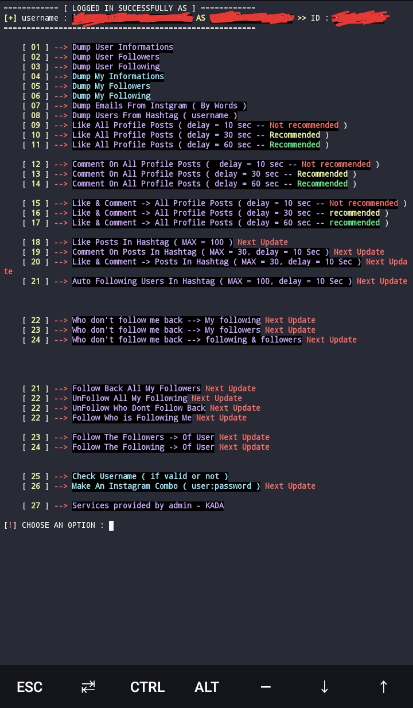
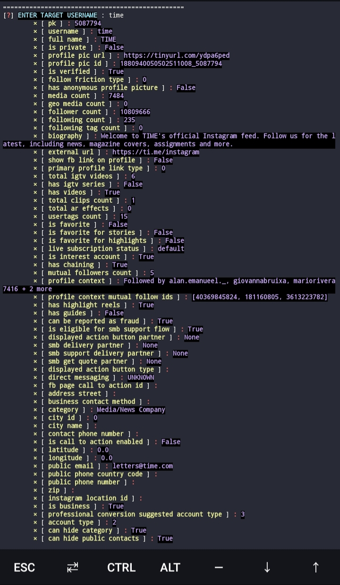
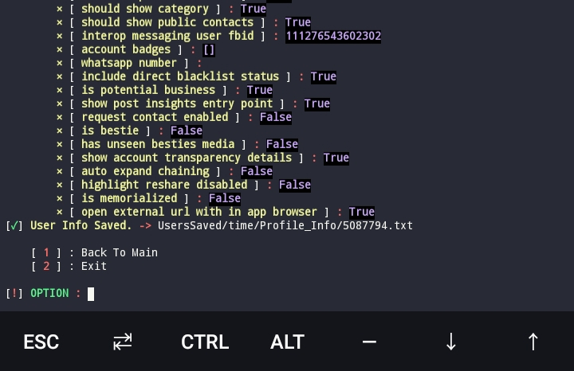

<p align="center">
   <a href="https://twitter.com/kada_soulayman">
      
   </a>
   <a href="https://github.com/zxllkada/Get-instagram-users-info---Any-instagram-account">
      
   </a>
   <a href="https://github.com/zxllkada">
      
   </a>
</p>

``Old Screenshot``


``New Screenshot``



# About this tool

:warning: Note! : DO NOT USE THIS TOOL FOR CKRACKING

This tool works prefect on Kali and it support termux (Phones "Android") without any problems
* If you found any Errors please contact me.
* Was developed using python3


This tool helping you to get Instagram users informations and dump their followers or following and more important features, without login to your account ( login required some times).


# install ON Kali Linux :
```
   sudo apt-get update && sudo apt-get -y full-upgrade
   sudo apt install git python
   git clone https://github.com/zxllkada/Get-instagram-users-info---Any-instagram-account.git
   cd Get-instagram-users-info---Any-instagram-account
   pip install -r requirements.txt

```

# install ON TERMUX :
```
   pkg update && upgrade
   pkg install git python
   git clone https://github.com/zxllkada/Get-instagram-users-info---Any-instagram-account.git
   cd Get-instagram-users-info---Any-instagram-account
   pip install -r requirements.txt

```

# RUNNING
```
   cd Get-instagram-users-info---Any-instagram-account
   cd zxllkada
   cd Dump_Instagram_Information_ANY_ACCOUNT
   python3 InstaInfo_zxll.py
```
   OR
```
   cd zxllkada
   cd Dump_Instagram_Information_ANY_ACCOUNT
   python3 InstaInfo_zxll.py
```

* After that choose the mode, login to instagram can be required for some features. 


# WHAT THIS TOOL DO [ FEATURES ]
```
        - Dump users information
        - Dump users following
        - Dump users followers
        - Auto Following
        - Analysis your profile
        - Make instagram combos
        
        And more things coming soon... 
```
``Features : Dump user information ( Screenshot )``



# LOGIN TO INSTAGRAM [ SOURCE CODE ]
```python
def LoginToInstagram():
    global api

    logging.basicConfig()
    logger = logging.getLogger('instagram_private_api')
    logger.setLevel(logging.WARNING)

    print (f"{Y}LOGIN TO YOUR INSTAGRAM ACCOUNT IS REQUIRED *{W}\n")

    SmartCheck = json.load(open("SUPER_MODE/SuperLIB/checkJson/check.json"))
    if SmartCheck["loggedBefore"] == False :
        print (f"{LB}LOGIN TO YOUR INSTAGRAM ACCOUNT FIRST{W}")
        try :
            username = input(f"{Y}	>> ENTER USERNAME : {W}").strip()
            password = input(f"{Y}	>> ENTET THE PASSWORD : {W}").strip()
        except :
            sys.exit()
        ModifyJson = { "loggedBefore" : True }
        with open("SUPER_MODE/SuperLIB/checkJson/check.json", "w") as outfile :
            json.dump(ModifyJson, outfile)

    else :
        msg = input(f"{Y}==>{G} Do You Want To Use Current Cookies ? (Y/N) : {W}").strip()
        if msg.lower() == 'y' :
            username = ''
            password = ''
        elif msg.lower() == 'n' :
            Fix()
            print (f"{LB}LOGIN TO YOUR INSTAGRAM ACCOUNT FIRST{W}")
            try :
                username = input(f"{Y}	>> ENTER YOUR USERNAME : {W}").strip()
                password = input(f"{Y}	>> ENTET THE PASSWORD : {W}").strip()
            except :
                sys.exit()
            ModifyJson = { "loggedBefore" : True }
            with open("SUPER_MODE/SuperLIB/checkJson/check.json", "w") as outfile :
                json.dump(ModifyJson, outfile)
        else :
            print (f"{R}[!]{W} {Y}Answer with (Y/N) next time.{W}")
            sys.exit()

    print ("")
    device_id = None
    try:

        settings_file = "SUPER_MODE/SuperLIB/cookie/cookies.txt"
        if not os.path.isfile(settings_file):
            print (f'[ {Y}MAKING NEW COOKIES{W} ] : {settings_file}')
            api = Client(username, password, on_login=lambda x: onlogin_callback(x, "SUPER_MODE/SuperLIB/cookie/cookies.txt"))
        else:
            with open(settings_file) as file_data:
                cached_settings = json.load(file_data, object_hook=from_json)

            print (f'[ {G}COOKIES FILE{W} ] : {settings_file}')

            device_id = cached_settings.get('device_id')
            api = Client(username, password, settings=cached_settings)

    except (ClientCookieExpiredError, ClientLoginRequiredError) as e:
        print (f'[ {R}COOKIES EXPIRED RE-LOGIN{W} ] : {e}\n')
        Fix()
        sys.exit()

    except ClientLoginError as e:
        print (f'[ {R}ClientLoginError{W} ] : {e}\n')
        Fix()
        sys.exit()

    except ClientError as e:
        print (f'[ {R}ClientError{W} ] : {e.msg}\n[ {R}Code{W} ] : {e.code}\n[ {R}Response{W} ] : {e.error_response}\n')
        sys.exit()

    except Exception as e:
        print (f'[ {R}Unexpected Exception{W} ] : {e}\n')
        sys.exit()

    except KeyboardInterrupt :
        sys.exit()


    cookie_expiry = api.cookie_jar.auth_expires
    print (f"[ {G}Cookie Expiry IN{W} ] : {datetime.datetime.fromtimestamp(cookie_expiry).strftime('%Y-%m-%dT%H:%M:%SZ')}\n")

    userId = api.authenticated_user_id
    UserInfo = api.user_info(userId)
    
    print (f"{G}LOGGED IN SUCCESSFULLY AS{W}",UserInfo["user"]["username"])
    

```
```
https://github.com/zxllkada/Get-instagram-users-info---Any-instagram-account/blob/master/zxllkada/Dump_Instagram_Information_ANY_ACCOUNT/SUPER_MODE/SuperLIB/login.py
```

# DATA [ UPDATES SOON ]
```
[ SURE FACE DATA ] 
        、__ [~] Username
        、__ [~] Full Name
        、__ [~] Biography
        、__ [~] External Url
        、__ [~] External Url Linkshimmed
        、__ [~] Edge Followed By
        、__ [~] Edge Follow
        、__ [~] is Private
        、__ [~] is Verified
        、__ [~] Category Enum
        、__ [~] Profile Pic Url Hd
        、__ [~] Show Suggested Profiles
        、__ [~] Show Follow Dialog
        、__ [~] Show View Shop
        、__ [~] Highlight Reel Count
        、__ [~] Edge Felix Video Timeline
        、__ [~] Edge Owner To Timeline Media
        、__ [~] Has Clips
        、__ [~] Has Guides
        、__ [~] Has Ar Effects
        、__ [~] Has Channel
 [ DEEP DATA ]
        、__ [~] id
        、__ [~] is Joined Recently
        、__ [~] Has Public Story
        、__ [~] is Live Now
        、__ [~] [ ___Global Rank___ ]
        、__ [~] Followers Rank
        、__ [~] Following Rank
        、__ [~] Media Rank
        、__ [~] Total Likes
        、__ [~] Total Comments
        、__ [~] [ ___TOP 3 Posts___ ]      
        、__ [~] 1 st
        、__ [~] 2 nd
        、__ [~] 3 rd
        、__ [~] Overall Category Name
        、__ [~] Category Name
        、__ [~] is Business Account
        、__ [~] Should Show Category
        、__ [~] Business Category Name
        、__ [~] Country Block
        、__ [~] Toast Content On Load
        、__ [~] Profile Pic Edit Sync Props
        、__ [~] More Info About Profile Pic > Next Updates
 [ DARK DATA ]
        、__ [~] Loggin Page Id
        、__ [~] Fbid
        、__ [~] Connected Fb Page
        、__ [~] Email
        、__ [~] Phone
        、__ [~] Whatsapp Number
        、__ [~] Twitter Account > Next Updates
        、__ [~] Facebook Account > Next Updates
        、__ [~] Web Match > Next Updates
        、__ [~] Youtube Match > Next Updates
        、__ [~] Image Match > Next Updates
        、__ [~] Info Matched > Next Updates
        、__ [~] Link Matched > Next Updates
```

# SAVING [ UPDATES SOON ]

```
[^] SAVE PROFILE INFO
[^] SAVE PROFILE PIC
[^] SAVE PRIFILE PIC INFO
[^] SAVE INSTAGRAM COMBOS
[^] SAVE FOLLOWING
[^] SAVE FOLLOWERS
```
