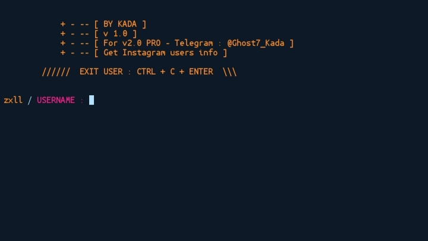

# instainfo_zxll..  ``Screenshot``


# About this tool
This tool works prefect on termux without any ERRORS
* If you found any ERRORS open issues or contact me.
* Was developed using python3

```
   Telegram : @Ghost7_Kada
   Facebook : Facebook.com/zxlll
```

This tool helping you to get Instagram users information without login to your account,
all what you need is USERNAME.

* GET 
```
   PROFILE NAME : {full_name}
   USERNAME : {username}
   ID : {id}
   BIO : {biography}
   FOLLOWERS : {edge_followed_by}
   FOLLOWING : {edge_follow}
   POSTS : {edge_owner_to_timeline_media}
   PRIVATE : {is_private}
   VERIFIED : {is_verified}
   BUSINESS ACCOUNT : {is_business_account}
```
# Next update 
* Get more information 
``` 
   PROFILE PIC : {profile_pic_url_hd}
            '
            '----- Auto SAVING.
   HIGHLIGHT REEL : {highlight_reel_count}
   COUNTRY BLOCK : {country_block}

   IGTV --
          \_ {count}
          /
          \_ {page_info}
          /
          \_ {egdes} #Take time.
   
    BUSINESS CATEGORY NAME : {business_category_name}
    CATEGORY ID : {category_id}
```
# install ON TERMUX
* [USING] :
```
   pkg update && upgrade
   pkg install git python2
   pip2 install requests
   git clone https://github.com/zxllkada/Get-instagram-users-info---Any-instagram-account
   
```
# RUNNING
```
   cd Get-instagram-users-info---Any-instagram-account
   cd zxllkada
   cd Dump_Instagram_Information_ANY_ACCOUNT
   python instainfo_zxll.py
```
* After that enter username and enjoy.
